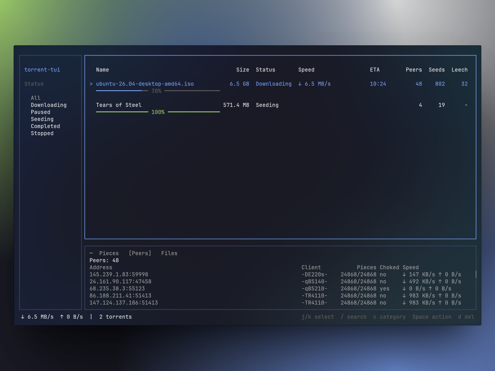

# torrent-tui

**A terminal BitTorrent client for focused download management.** Add `.torrent` files, track active transfers, and manage sessions from a clean keyboard-driven interface.

[](https://www.npmjs.com/package/torrent-tui)
[](https://www.npmjs.com/package/torrent-tui)
[](https://github.com/ryadios/torrent-tui/actions/workflows/ci.yml)
[](./LICENSE)

[Install](#install) · [Quickstart](#quickstart) · [Commands](#commands) · [Configuration](#configuration) · [Development](#development)



> [!NOTE]
> `torrent-tui` currently requires [Bun](https://bun.sh) and [NodeJS](https://nodejs.org/en/download). Standalone binaries are planned after the npm CLI release path is stable.

> [!IMPORTANT]
> Use torrent clients only with content you have the right to download or share. `torrent-tui` is a client implementation, not a content source.

## Install

Run without installing:

```bash
bunx torrent-tui@latest
```

Or install globally:

```bash
bun add -g torrent-tui
torrent-tui
```

> [!TIP]
> If the global command is not found, add Bun's global bin directory to your shell path:
>
> ```bash
> export PATH="$HOME/.bun/bin:$HOME/.cache/.bun/bin:$PATH"
> ```

## Quickstart

Start the TUI:

```bash
torrent-tui
```

From inside the app:

| Key | Action |
| --- | --- |
| `j` / `k` or arrow keys | Move selection |
| `Tab` / `Shift+Tab` | Change focus |
| `a` | Add a `.torrent` file or magnet link |
| `/` | Search torrent names |
| `Space` on the torrent table | Pause, resume, or restart the selected torrent |
| `c` on the torrent table | Change the selected torrent's category |
| `d` on the torrent table | Remove the selected torrent |
| `D` on the torrent table | Remove the selected torrent and downloaded files |
| `m` on the sidebar | Manage categories |
| `q` | Quit |

Search filters the torrent table by name. Press `/` to start typing, `Enter` to keep the current filter, or `Esc` to clear it.

The add dialog has `Files` and `Magnet` tabs. Use `Tab` to switch tabs, `j` / `k` or arrow keys to choose a `.torrent` file, and `Enter` to add it. In the `Magnet` tab, paste or type a magnet URI and press `Enter` to submit it. After adding a torrent, choose a category before the download starts; categories can route torrents to preset save paths.

Category dialogs use `j` / `k` or arrow keys to move and `Enter` to choose. Press `n` to create a category, `c` to reassign the selected torrent from the table, and `m` from the sidebar to manage categories. In the category manager, use `e` or `Enter` to edit and `d` to delete. In the category editor, type the name, press `b` to browse for a save path, `x` to clear the path, and `Enter` to save. The directory picker uses `Enter` to open a folder, `Space` to select the current folder, `Backspace` or left arrow to go up, and `n` to create a folder under your home directory.

The detail panel has `Pieces`, `Peers`, and `Files` tabs. Focus it with `Tab`, then use `h` / `l`, `[` / `]`, or left/right arrows to switch tabs. In the `Files` tab, use `j` / `k` to move through long file lists.

Multi-file torrents open a file picker before download. Use `Space` to toggle a file, `a` to select all, `n` to select none, and `Enter` to confirm. Pressing `Esc` accepts all files and closes the picker.

## Commands

The package also exposes command-line workflows around the same torrent engine:

```bash
torrent-tui --help
torrent-tui --version
torrent-tui file.torrent
torrent-tui 'magnet:?xt=urn:btih:...'
torrent-tui file.torrent --verify
torrent-tui file.torrent --handshake
torrent-tui file.torrent --download
torrent-tui 'magnet:?xt=urn:btih:...' --download
torrent-tui file.torrent --info
torrent-tui file.torrent --info --json
torrent-tui 'magnet:?xt=urn:btih:...' --info
```

| Command | Description |
| --- | --- |
| `torrent-tui` | Start the terminal UI. |
| `torrent-tui <file.torrent>` | Start the TUI and add the torrent. |
| `torrent-tui <magnet-uri>` | Start the TUI, fetch magnet metadata, cache it, and start the torrent. |
| `torrent-tui <file.torrent> --verify` | Create storage, verify local pieces, and print a tracker summary. |
| `torrent-tui <file.torrent> --handshake` | Connect to peers and print a connection summary. |
| `torrent-tui <file.torrent> --download` | Run the downloader without launching the TUI. |
| `torrent-tui <magnet-uri> --download` | Fetch magnet metadata, cache it, then run the downloader without launching the TUI. |
| `torrent-tui <file.torrent> --info` | Print torrent metadata without launching the TUI. |
| `torrent-tui <file.torrent> --info --json` | Print torrent metadata as machine-readable JSON. |
| `torrent-tui <magnet-uri> --info` | Print cached magnet metadata without launching the TUI. |

Magnet support covers BitTorrent v1 `btih` magnets with trackers (`tr`), explicit peers (`x.pe`), or DHT-discovered peers. After metadata is cached, `--verify`, `--handshake`, and `--info` can use the same magnet URI.

## Configuration

Settings are stored at:

```text
${XDG_CONFIG_HOME:-~/.config}/torrent-tui/settings.json
```

Default settings:

```json
{
	"downloadPath": "~/Downloads",
	"maxConnections": 50,
	"torrentFolder": "~/Downloads",
	"categories": [],
	"defaultCategoryId": null,
	"downloadRateLimitBps": 0,
	"uploadRateLimitBps": 0,
	"enableWebSeeds": true,
	"maxWebSeedConnections": 3,
	"webSeedMaxRequestBytes": 16777216,
	"blocklistEnabled": false,
	"blocklistPaths": [],
	"blocklistUrl": "",
	"blocklistRefreshHours": 168,
	"encryption": "preferred",
	"enableLsd": true
}
```

Resume data is stored under:

```text
${XDG_DATA_HOME:-~/.local/share}/torrent-tui/resume
```

The session registry is stored at:

```text
${XDG_DATA_HOME:-~/.local/share}/torrent-tui/session.json
```

It keeps the list of torrents the TUI should restore on startup.

### Torrent States

The TUI shows detailed per-torrent states while keeping the sidebar filters simple.

| State | Meaning |
| --- | --- |
| `Queued` | The `.torrent` was accepted and is waiting for engine startup. |
| `Metadata` | A magnet link was accepted and metadata is being fetched from peers. |
| `Checking` | Local files are being checked against torrent piece hashes. |
| `Connecting` | Trackers were contacted and the client is connecting to peers. |
| `Downloading` | Pieces are actively being requested or received. |
| `Stalled` | The torrent is incomplete but has no usable peers right now. Press `Space` to retry. |
| `Paused` | The active downloader was paused by the user. |
| `Seeding` | All pieces are present and the torrent can upload to peers. |
| `Stopped` | The torrent is saved in the session but not running. |
| `Missing` | Previously tracked files are missing from disk after restore or recheck. |
| `Error` | Startup, storage, or torrent metadata handling failed. |

The `Downloading` sidebar filter includes queued, checking, connecting, downloading, and stalled torrents so active work stays grouped together.

### What Each Setting Does

| Setting | Purpose | When it applies |
| --- | --- | --- |
| `downloadPath` | Where torrent payload files are written and verified. | On torrent add, resume, verify, and startup restore. |
| `torrentFolder` | Folder shown by the add-torrent dialog. | When you open the add dialog. |
| `categories` | Save-path presets shown during add and category reassignment. | When adding torrents, reassigning categories, and restoring sessions. |
| `defaultCategoryId` | Optional category preselected in the add flow. | When choosing a category for a new torrent. |
| `maxConnections` | Maximum number of peers the client will connect to per torrent. | During peer discovery and download. |
| `downloadRateLimitBps` | Download speed cap in bytes per second. `0` means unlimited. | During downloads. |
| `uploadRateLimitBps` | Upload speed cap in bytes per second. `0` means unlimited. | During uploads to peers. |
| `enableWebSeeds` | Enables BEP 19 HTTP web seed downloads. | For torrents with `url-list` web seeds. |
| `maxWebSeedConnections` | Maximum concurrent web seed workers. | During web seed downloads. |
| `webSeedMaxRequestBytes` | Largest HTTP range request sent to a web seed. | During web seed downloads. |
| `blocklistEnabled` | Enables peer blocklist filtering. | Before peer connections are accepted or opened. |
| `blocklistPaths` | Local blocklist files to load. | When blocklists are enabled. |
| `blocklistUrl` | Optional remote blocklist URL to cache and load. | When blocklists are enabled. |
| `blocklistRefreshHours` | Remote blocklist cache refresh interval. | When `blocklistUrl` is configured. |
| `encryption` | Peer encryption policy: `allowed`, `preferred`, or `required`. | During peer connection setup. |
| `enableLsd` | Enables local peer discovery on the LAN. | For non-private torrents. |

### Tuning Tips

- Use a fast local SSD for `downloadPath` if you want quicker verification and fewer stalls on reopen.
- Point `torrentFolder` at the directory where you keep `.torrent` files so adding torrents is faster.
- Use categories when different torrents should land in different save paths. A category without a save path falls back to `downloadPath`.
- Lower `maxConnections` if your network or CPU struggles with many peers; raise it if you want more parallel peer selection.
- Use `downloadRateLimitBps` and `uploadRateLimitBps` when you need bandwidth caps.
- Set `encryption` to `required` only if you want to reject plaintext peers.
- Enable blocklists only with lists you trust; malformed or unreachable lists are ignored or fall back to cached data.
- Fresh torrents skip full zero-file verification. Existing files are checked cooperatively, so the TUI should stay responsive during large rechecks.
- If a torrent stays `Stalled`, the client did not find a usable peer. Try again later with `Space`, or check tracker availability.
- Settings are read when the app starts. If you edit `settings.json` manually, restart the app to pick up the changes.
- If the settings file is invalid, torrent-tui falls back to defaults and logs a config warning.
- `session.json` and the resume files are rewritten automatically as torrent state changes, so you normally do not need to edit them by hand.

## Status

`torrent-tui` is an early Bun-first torrent client with a TUI and CLI inspection workflows.

| Area | Status |
| --- | --- |
| `.torrent` metadata parsing | Available |
| HTTP and UDP trackers | Available |
| Peer handshakes and piece download | Available |
| Resume data | Available |
| Multi-torrent TUI | Available |
| Magnet links | Available for v1 magnets with tracker, explicit-peer, or DHT discovery |
| Detail panel | Pieces, peers, and files tabs |
| File selection | Available for multi-file torrents before download |
| Search | Name-only torrent table filtering |
| Categories | Save-path presets, add-flow selection, reassignment, and management dialogs |
| Engine controls | Download/upload rate limits and max peer connections |
| Peer discovery | Trackers, DHT, PEX, and LSD |
| Web seeds | BEP 19 HTTP web seeds |
| Peer filtering | Local or cached remote blocklists |
| Protocol encryption | MSE/PE with allowed, preferred, or required policy |
| Padding files | BEP 47 padding files are hidden from payload file lists |
| CLI inspection | `--info`, `--info --json`, and man page packaging |
| Standalone binaries | Not included yet |

## Development

```bash
bun install
bun run dev
```

Before opening a PR:

```bash
bun run typecheck
bun test
bun run smoke
npm publish --dry-run
```

For formatting and lint fixes:

```bash
bun run check:fix
```

## Release Flow

Releases are published from GitHub Actions with generated GitHub release notes.

1. Update `package.json` to the new version.
2. Run local checks:

   ```bash
   bun run typecheck
   bun test
   bun run smoke
   npm publish --dry-run
   ```

3. Commit and push the version change.
4. Run the **Release** workflow manually with the version number.

The workflow publishes to npm with trusted publishing, creates `vX.Y.Z`, and creates a GitHub release with `--generate-notes`.

## License

MIT License. See [LICENSE](./LICENSE).
