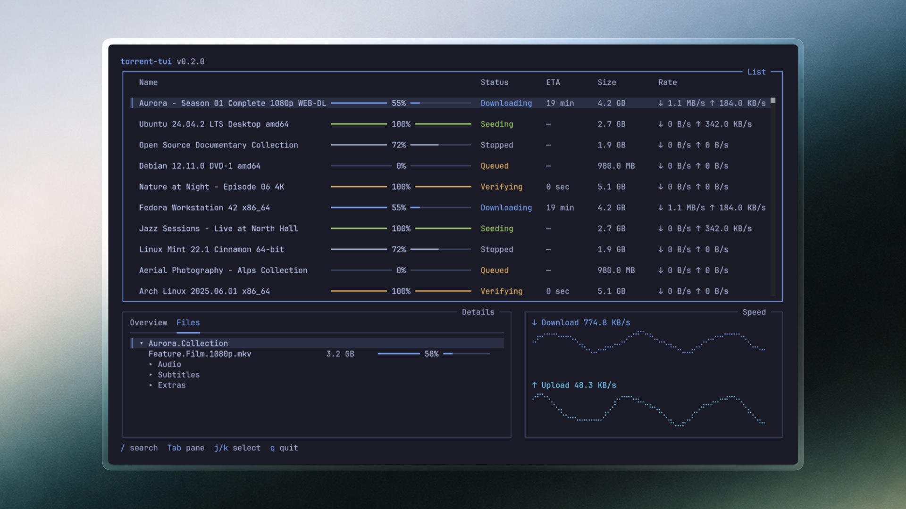

# torrent-tui

**A keyboard-driven terminal interface for managing a Transmission session.**

View torrent progress and transfer rates, inspect torrent details and files, and manage downloads without leaving the terminal.

[Quick start](#quick-start) · [Controls](#controls) · [CLI](#cli) · [Development](#development)



> [!NOTE]
> Requires Bun and a running Transmission daemon with RPC enabled at `http://127.0.0.1:9091/transmission/rpc`. The RPC endpoint is fixed in this version.

## Quick start

```bash
git clone https://github.com/ryadios/torrent-tui.git
cd torrent-tui
bun install
bun dev
```

## Controls

- Move through torrents with `j` / `k` or the arrow keys.
- Search by name with `/`; press `Enter` to apply or `Esc` to clear.
- Press `Tab` to switch between the torrent list and details pane. In the details pane, use left/right arrows to switch tabs; in the Files tab, use `j` / `k` to move and `Enter` to expand.
- Press `a` to add a `.torrent` file, magnet link, or URL; `s` to start, `p` to stop, or `d` to remove the selected torrent.
- In the remove prompt, `Enter` keeps downloaded data; `Shift+Enter` deletes it.
- Press `q` to quit.

## CLI

```bash
bun run src/index.tsx --help
bun run src/index.tsx --version
bun run src/index.tsx list
bun run src/index.tsx add ./file.torrent
bun run src/index.tsx start <hash>
bun run src/index.tsx stop <hash>
bun run src/index.tsx remove <hash>
```

`add` accepts a local `.torrent` path, magnet link, or URL. Use a full torrent hash with `start`, `stop`, and `remove`. `remove` keeps downloaded data.

## Development

```bash
bun test
bunx biome check ./src ./tests
bunx tsc --noEmit
```
